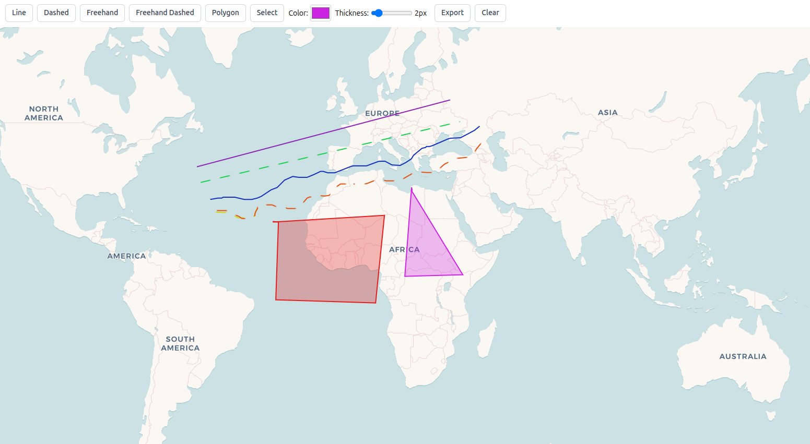

# maplibre-gl-multiple-color-draw

A production-ready drawing library for MapLibre GL JS. Draw lines, polygons, and freehand shapes on maps with multiple colors, dynamic styling, and full GeoJSON support.

## Features

- **6 Drawing Modes**: Line, Dashed Line, Freehand, Freehand Dashed, Polygon, and Select/Move
- **Simple API**: Clean, intuitive interface with TypeScript support
- **GeoJSON Export**: All features stored as standard GeoJSON
- **Dynamic Styling**: Change color and thickness at runtime
- **React Hook**: Built-in useMapDraw hook for React applications
- **Lightweight**: Zero dependencies (only peer dependency: maplibre-gl)
- **Type Safe**: Full TypeScript definitions included
- **Framework Agnostic**: Works with any JavaScript framework

## Installation

```bash
npm install maplibre-gl-multiple-color-draw
```

**Peer Dependencies:**

```bash
npm install maplibre-gl
```

## Live Demo

[](https://maplibre-gl-multiple-color-draw-dem.vercel.app/)

[View Live Demo →](https://maplibre-gl-multiple-color-draw-dem.vercel.app/)

## Quick Start

### React + TypeScript Example

Here's a complete example that demonstrates all features. The styling uses Tailwind CSS classes, but you can replace them with inline styles or any CSS framework:

```tsx
import { useEffect, useRef, useState } from "react";
import maplibregl, { Map as MaplibreMap } from "maplibre-gl";
import { useMapDraw } from "maplibre-gl-multiple-color-draw";
import "maplibre-gl/dist/maplibre-gl.css";

function MapDrawComponent() {
  const mapContainer = useRef<HTMLDivElement>(null);
  const mapRef = useRef<MaplibreMap | null>(null);
  const [map, setMap] = useState<MaplibreMap | null>(null);
  const [color, setColorState] = useState("#3388ff");
  const [thickness, setThicknessState] = useState(2);

  // Initialize map
  useEffect(() => {
    if (!mapContainer.current || mapRef.current) return;
    const newMap = new maplibregl.Map({
      container: mapContainer.current,
      style: "https://basemaps.cartocdn.com/gl/voyager-gl-style/style.json",
      center: [0, 0],
      zoom: 2,
    });
    mapRef.current = newMap;
    setMap(newMap);
    return () => {
      newMap.remove();
      mapRef.current = null;
    };
  }, []);

  // Initialize drawing
  const { enable, setMode, setColor, setThickness, getGeoJSON, clear } = useMapDraw(map, {
    color,
    thickness,
  });

  // Enable drawing when map is ready
  useEffect(() => {
    if (map) enable();
  }, [map, enable]);

  const handleColorChange = (e: React.ChangeEvent<HTMLInputElement>) => {
    const newColor = e.target.value;
    setColorState(newColor);
    setColor(newColor);
  };

  const handleThicknessChange = (e: React.ChangeEvent<HTMLInputElement>) => {
    const value = Number(e.target.value);
    setThicknessState(value);
    setThickness(value);
  };

  const handleExport = () => {
    const geoJSON = getGeoJSON();
    const blob = new Blob([JSON.stringify(geoJSON, null, 2)], { type: "application/json" });
    const url = URL.createObjectURL(blob);
    const a = document.createElement("a");
    a.href = url;
    a.download = "map-drawing.geojson";
    a.click();
    URL.revokeObjectURL(url);
  };

  const btn = "px-3 py-1.5 rounded-md border border-gray-300 text-sm font-medium text-gray-700 bg-white hover:bg-gray-50";

  return (
    <div>
      <div style={{ padding: "10px", display: "flex", gap: "8px", flexWrap: "wrap", alignItems: "center" }}>
        <button onClick={() => setMode("line")} className={btn}>Line</button>
        <button onClick={() => setMode("dashed-line")} className={btn}>Dashed</button>
        <button onClick={() => setMode("freehand")} className={btn}>Freehand</button>
        <button onClick={() => setMode("freehand-dashed")} className={btn}>Freehand Dashed</button>
        <button onClick={() => setMode("polygon")} className={btn}>Polygon</button>
        <button onClick={() => setMode("select")} className={btn}>Select</button>

        <div style={{ display: "flex", alignItems: "center", gap: "4px" }}>
          <label style={{ fontSize: "14px" }}>Color:</label>
          <input type="color" value={color} onChange={handleColorChange} style={{ width: "40px", height: "32px", border: "1px solid #d1d5db", borderRadius: "4px", cursor: "pointer" }} />
        </div>

        <div style={{ display: "flex", alignItems: "center", gap: "4px" }}>
          <label style={{ fontSize: "14px" }}>Thickness:</label>
          <input type="range" min="1" max="10" value={thickness} onChange={handleThicknessChange} style={{ width: "80px" }} />
          <span style={{ fontSize: "14px", minWidth: "30px" }}>{thickness}px</span>
        </div>

        <button onClick={handleExport} className={btn}>Export</button>
        <button onClick={() => clear()} className={btn}>Clear</button>
      </div>
      <div ref={mapContainer} style={{ width: "100%", height: "800px" }} />
    </div>
  );
}

export default MapDrawComponent;
```

**Usage in your App:**

```tsx
import MapDrawComponent from './MapDrawComponent';

function App() {
  return (
    <div className="App">
      <MapDrawComponent />
    </div>
  );
}

export default App;
```

## API Reference

### MapDraw Class

#### Constructor

```typescript
new MapDraw(map: Map, options?: MapDrawOptions)
```

**Parameters:**
- `map` (Map): A MapLibre GL Map instance
- `options` (MapDrawOptions, optional): Configuration options

**Options:**
- `color?`: string - Default line/fill color (default: '#3388ff')
- `thickness?`: number - Default line thickness in pixels (default: 2)
- `dashArray?`: number[] - Dash pattern for dashed lines (default: [5, 5])
- `defaultMode?`: DrawMode - Initial mode when enabled (default: 'line')
- `enabled?`: boolean - Auto-enable on creation (default: false)

#### Methods

##### `enable(): void`
Enables drawing on the map. Must be called before drawing can begin (unless enabled: true in options).

##### `disable(): void`
Disables drawing and stops all interactions. Features remain on the map but cannot be modified.

##### `setMode(mode: DrawMode): void`
Changes the active drawing mode. Available modes:
- 'line' - Click to place points, double-click to finish
- 'dashed-line' - Same as line but with dash pattern
- 'freehand' - Click once to start, move mouse to draw, click again to finish
- 'freehand-dashed' - Freehand drawing with dashed line style
- 'polygon' - Click to place vertices, double-click or right-click to finish
- 'select' - Click to select features, drag to move selected features

##### `setColor(color: string): void`
Updates the color for new features. Accepts any valid CSS color (hex, rgb, rgba, named colors).

##### `setThickness(thickness: number): void`
Updates the line thickness for new features (in pixels).

##### `getFeatures(): DrawFeature[]`
Returns all drawn features as an array of DrawFeature objects.

##### `getGeoJSON(): GeoJSON`
Returns all features as a standard GeoJSON FeatureCollection, ready for export or API submission.

##### `clear(): void`
Removes all drawn features from the map.

##### `destroy(): void`
Completely cleans up all resources, removes layers, event listeners, and disables drawing. Call this when unmounting your component or removing the map.

### React Hook

For React applications, use the useMapDraw hook:

```typescript
import { useMapDraw } from 'maplibre-gl-multiple-color-draw';

const { 
  mapDraw,      // MapDraw instance (null until map is ready)
  enable,       // Enable drawing
  disable,      // Disable drawing
  setMode,      // Change mode
  setColor,     // Update color
  setThickness, // Update thickness
  getFeatures,  // Get all features
  getGeoJSON,   // Get GeoJSON
  clear         // Clear all drawings
} = useMapDraw(map, {
  color: '#3388ff',
  thickness: 2
});
```

**Parameters:**
- `map`: Map | null - MapLibre GL Map instance (can be null initially)
- `options?`: MapDrawOptions - Same options as MapDraw constructor

**Returns:**
An object containing all MapDraw methods plus the mapDraw instance.

## TypeScript Support

Full TypeScript definitions are included:

```typescript
import type { 
  DrawMode, 
  DrawFeature, 
  MapDrawOptions 
} from 'maplibre-gl-multiple-color-draw';
```

## Links

- **GitHub**: [View on GitHub](https://github.com/kashishgadhiya/maplibre-gl-multiple-color-draw)
- **NPM Package**: [View on NPM](https://www.npmjs.com/package/maplibre-gl-multiple-color-draw)

## Browser Support

Works with all modern browsers that support:
- ES6+ JavaScript
- MapLibre GL JS (^3.0.0 or ^4.0.0)

## License

MIT

## Contributing

Contributions are welcome! Please feel free to submit a Pull Request.
